# VRAI Proof of Concept

This document is a work in progress. Information here is subject to change. 

This section of this project contains images of the first implementation of VRAI in the digital logic simulator Turing 
Complete. 

As some of the components are harder to reason about, refer to this document to know the specifics of how they were 
connected.

The components will be discussed based on the units they are represented by. The ordering is as follows:
- Map of the Core
- Components of the overall System
- Components of UNIT SYS
- Components of UNIT ALU
- Components of UNIT BIT
- Components of UNIT JMP
- Components of UNIT MEM

Refer to the main ISA document for specifics on the encoding scheme for each unit. 

## The Core
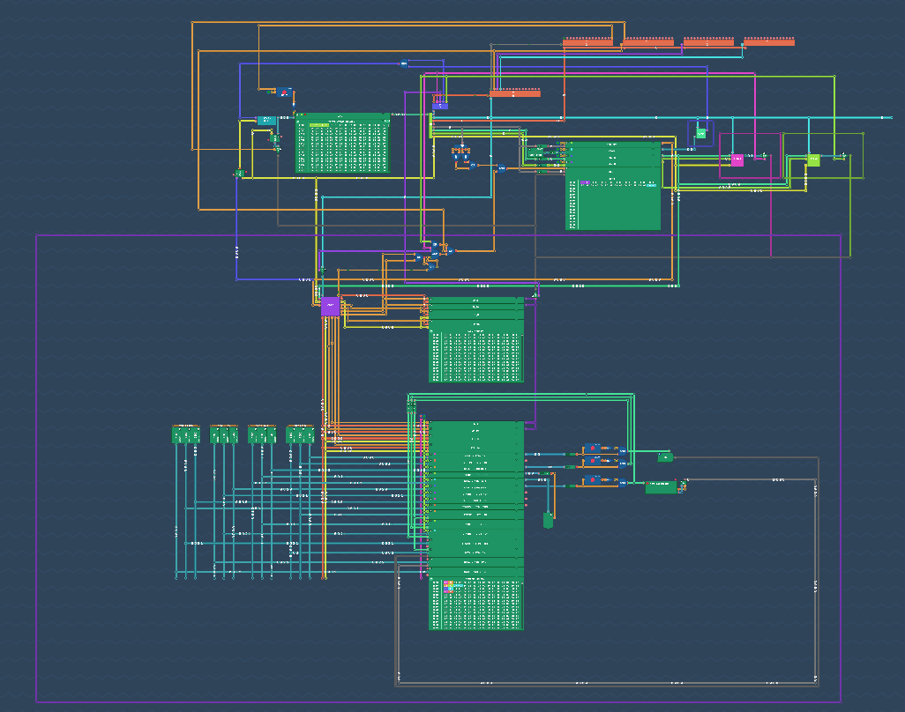

The above image is the overall core design. Due to the size of the core, it may be difficult to identify where each 
main part of the VRAI processor lies. For that reason, refer to the following maps of the Core to understand where each 
unit lies and how they interact with the system. 

### Unit Map
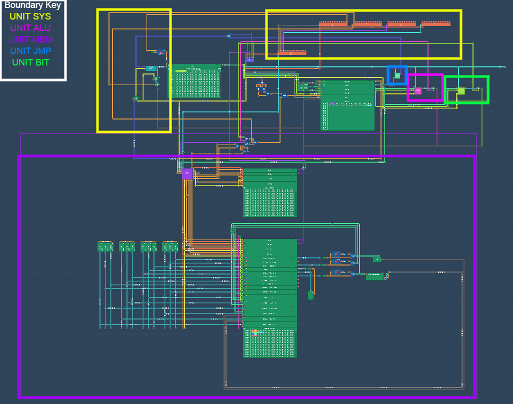

### Flow Map

(need image of map)

From this point onward, this document will be discussing the actual implementation details of the Turing Complete 
version of VRAI-16. 

## Components of UNIT SYS

Decoding a UNIT SYS instruction involves the following:
- Decoding the 4b field "CODE"
- Decoding the 4b field "SUBCODE"

Thus, the implementation of UNIT SYS (in Turing Complete) uses 1 main "CODE" decoder whose outputs are tied to the 
enable signals of the "SUBCODE" decoders. 

The implementation of "CODE" decoder can be referenced below:

")

This implementation is functionally identical to a 4b-decoder (4-to-16 decoder) with an enable input.
The enable input used comes from the Unit Decoder. 

The outputs "EX CTRL" and "ACCESS" indicate the two main aspects of UNIT SYS instructions:
- "EX CTRL" refers to aspects of the processor related to the execution control. This primarily refers to the HALT
register and the nop instruction. 
- "ACCESS" refers to instructions that access specific architectural values of the system. Unlike the registers of the 
register file, these do have meaning attached (as they only live in UNIT SYS). The most common of these is the counter.

Similarly, the SUBCODE decoders are implemented using 4b decoders with enable inputs. The enable signal is tied to the 
respective CODE decoder output specifying the category of the instruction. 
Full 4b-decoders are used here, but not all outputs have been given meaning. A majority of these outputs are a part of 
the reserved space of SYS instructions. Since the Turing Complete implementation is the primary way for the design 
process of VRAI, the full decoder was used to easily access those outputs in the future. 

The implementation of the 4b-decoder is trivial. 

As implied by the description of "ACCESS", the counter is considered part of UNIT SYS. While the main manipulation 
exists outside of UNIT SYS, accessing the counter value for future use is done through UNIT SYS 
(using the counter\[+x\]) instruction. 

## Components of UNIT ALU

### Overall Implementation
The implementation of UNIT ALU can be referenced below:

")

The highest bit of the code field is used to determine whether to use the register version of argument B or the 
immediate representation. This becomes the multiplexer (2-to-1) in the design. 

The block "ALU CORE" is the main implementation of the ALU. Since the instructions for both immediate B and register B 
are the same, the implementation can be isolated from the selection of value. 

This block's implementation can be found below:

")

The commented wires in the upper left are artifacts from during the implementation process. The comments are simply the 
encoding specified in the main ISA document.

### Specifics about Comparison

The CMP block handles the comparisons specified by the ISA (Signed Less Than \[S<\], Unsigned Less Than \[U<\],
Equality \[EQ\]). The following serves as a visual reference for the inside of the CMP block.

")

The implementation of these comparisons is as follows:
- EQ: \[indirect\] XNOR bit checking (Check that the XNOR of the two values is -1)
- S<: U< with the MSB of both values swapped (A\[15\] <--> B\[15\])
- U<: Less than by Induction (if the upper part of A is less than the upper part of B, then A < B. If equal, check the 
lower parts)

The U< and EQ signals are determined using the SW L(short for SW_LOWEQ because it determines A LOW B and A EQ B using 
"switches" \[which are similar to tri-state buffers\]) block. 

The base component of the SW_LOWEQ (which determines comparisons between 2 1-bit inputs) can be seen below:

")

## Components of UNIT BIT

### Overall Implementation
The implementation of UNIT BIT can be referenced below:

")

Since UNIT BIT is not completely symmetrical in its operations, two different versions of the BIT core were used. The 
upper BIT CORE block uses the register representation of argument B while the lower block uses the immediate version. 
The results of these are multiplexed using the highest bit of the code field. 

The non-immediate B BIT Core (the upper one):

")

The immediate B BIT Core (the lower one):

")

### Specifics about CLZ and CTZ
CTZ is implemented using a modified version of the CLZ implementation. This modification simply changes which bits are 
prioritized in the count (as well as changing the base 2b block to be a CTZ block instead of a CLZ block). 

Internally, the intermediate stages of the CTZ/CLZ implementation use a 1-hot encoded scheme to represent how many 0's 
were found from the prioritized section. The final stage converts the 1-hot encoded scheme into a binary value.

The original expansion from the 2b CTZ into a 4b (1-hot encoded) CTZ is shown below:

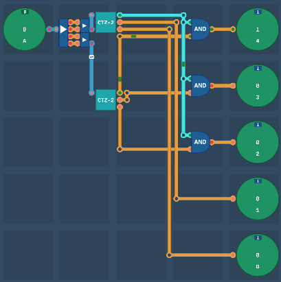

The CLZ version of this block is shown below:

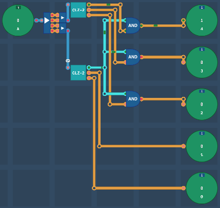 

As expected, the CTZ implementation places priority on the lowest bits of the value as opposed to the CLZ 
implementation's priority placement on the highest bits of the value. 

The base 2b CTZ block is shown below:

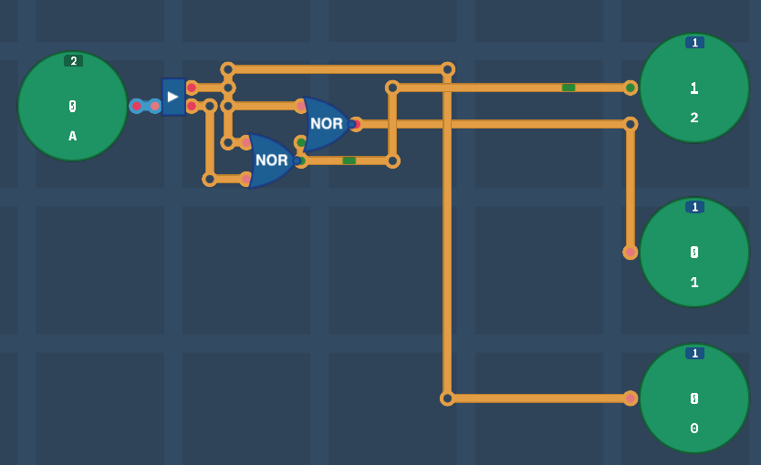

The base 2b CLZ block is shown below:

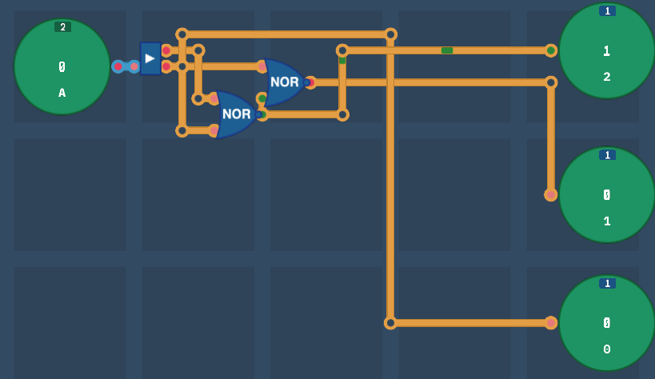

### Specifics about POPCNT
The POPCNT implementation does addition using values generated from a 
custom designed 4-bit popcount block. Refer to the following for this 
4-bit popcount implementation:

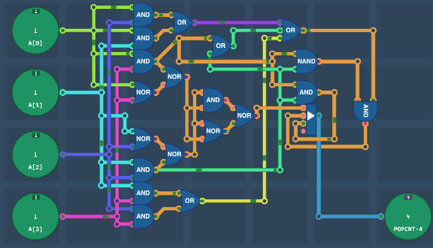

## Components of UNIT JMP
Refer to the following image for the implementation of UNIT JMP

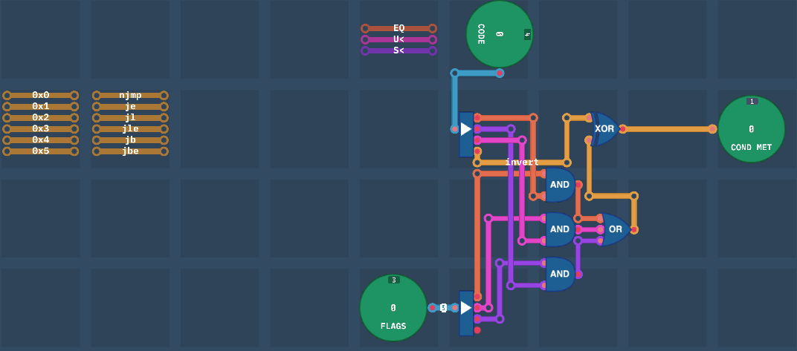

## Components of UNIT MEM

UNIT MEM, the unit responsible for interfacing with memory, is divided into 3 sections:
- Main Memory
- Device Memory
- Core Memory Controller

This unit is also expected to handle future memory-based optimizations including caches. Currently, such capabilities 
are not described in the main ISA (and as such, are not implemented in this proof-of-concept). 

### Specifics about the Core Memory Controller

The implementation of the main core element of UNIT MEM is shown below:

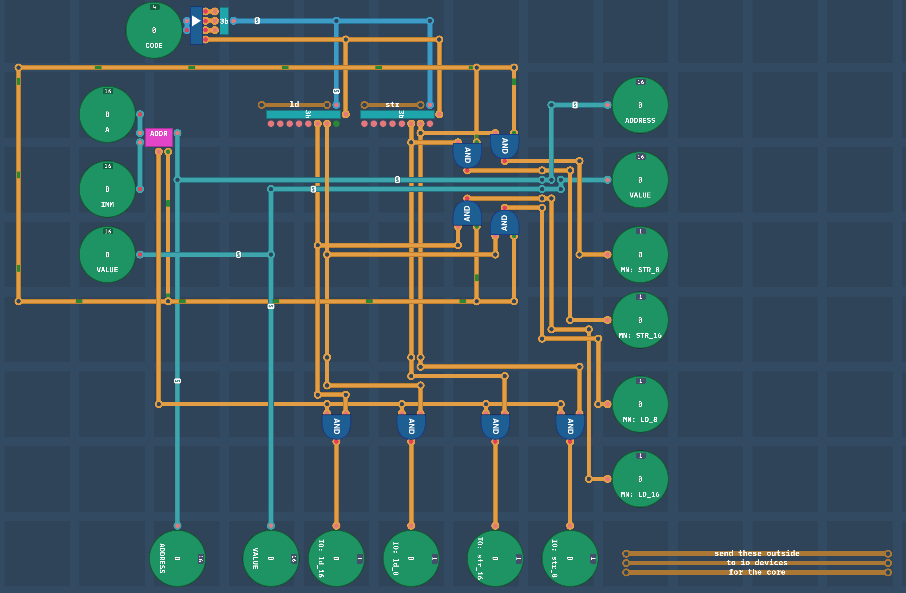

The shown implementation of the VRAI Memory Controller is used to decide which region of memory to retrieve/send data 
from/to. This controller consists of mostly decoding logic, in addition to some circuitry to determine the address 
to use when reading from the requested memory region. The decoding section consists of a 3b DISABLE decoder (3-to-8 with 
disable input) for load instructions, as well as a 3b ENABLE decoder (3-to-8 decoder with enable input) for store 
instructions. Most of the outputs of the decoders currently aren't used, but are still included in the circuit as they 
are reserved for use by this memory controller.

The base address is determined inside the ADDR block shown below:

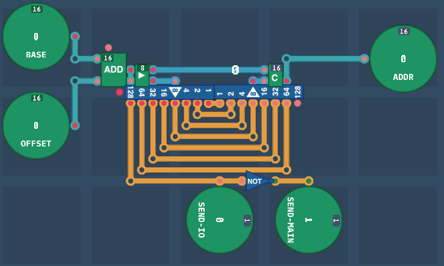
Since both split memory regions can only be indexed up to 0x7FFF, the highest bit of the ADDR is used to determine the 
region to send to. As such, this final bit is not included in the final address used by either of the memory regions.

### Specifics about Main Memory

The Main Memory region is shown below:

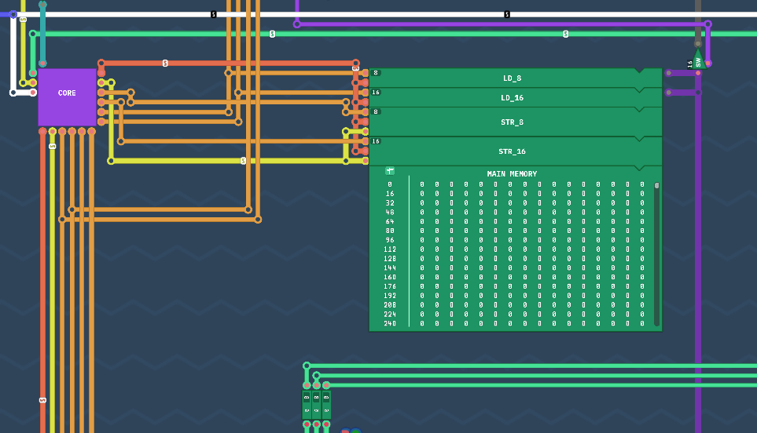

### Specifics about Device Memory

The Device Memory region can be referenced below:

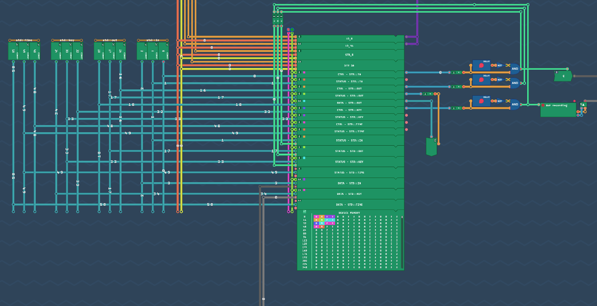

The Devices involved in the Turing Complete implementation of VRAI include:
- VRAI std::in
- VRAI std::out
- VRAI std::key (unused, keyboard input)
- VRAI std::time (unused, time in ns from unit epoch)

The left most section of the Device Memory Region image referenced holds constant values 
representing the address of specific parts of the designated device's region. Refer to the 
main ISA documentation for information on where each device's designated memory space is. 

The right most section of the referenced image is the location of the devices used in VRAI.
This region also contains special logic involved in writing to each of the status/data/ctrl region 
as needed after accessing the device. 

The middle region is the pure memory space used to store this information. The uppermost portion uses 
signals from the main memory controller for allowing the processor to store to and load from the requested 
memory region. 